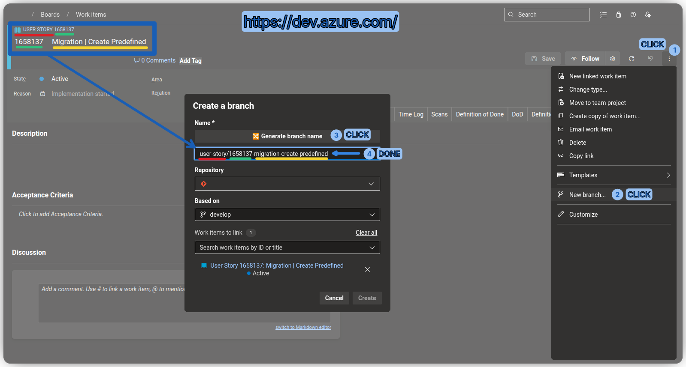
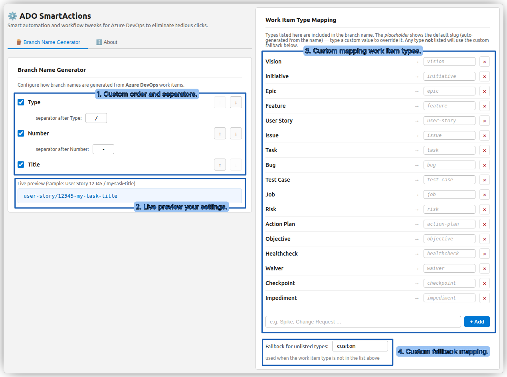

# Branch Name Generator

Automatically generates a properly formatted Git branch name from the currently open Azure DevOps work item — with a single button click.

---

## How it works

1. Navigate to any ADO work item page. Both Azure DevOps hosting variants are supported:
   ```
   https://dev.azure.com/YOUR-ORG/YOUR-PROJECT/_workitems/edit/1653488/
   https://YOUR-ORG.visualstudio.com/YOUR-PROJECT/_workitems/edit/1653488/
   ```

   

2. Open the **Create a branch** dialog.
3. Click the **🔀 Generate branch name** button that appears next to the **Name \*** field.
4. The branch name is instantly pasted into the field, ready to use.

> If the **Create a branch** dialog is not open yet, the generated name is **copied to the clipboard** automatically.

---

## Branch name format

The name is built from configurable **parts** (Type / Number / Title), each separated by a custom separator:

| Part   | Source                              | Example value     |
|--------|-------------------------------------|-------------------|
| Type   | Work item type (slugified)          | `user-story`      |
| Number | Work item ID from the URL           | `1653488`         |
| Title  | Title field value (slugified)       | `my-feature-name` |

**Example:**

| Field       | Value                            |
|-------------|----------------------------------|
| URL         | `.../edit/1653488/`              |
| Type        | `User Story`                     |
| Title       | `[PROJ-123] My feature`          |
| Branch name | `user-story/1653488-proj-123-my-feature` |

---

## Slugification rules

- Converted to lowercase
- Only `a–z`, `0–9` characters are kept
- Everything else is replaced with `-`
- Multiple consecutive dashes are collapsed into one
- Leading/trailing dashes are trimmed

---

## Configuration

Open the extension settings page (click the extension icon → **Options**) to customize:



### Branch name parts

Choose which parts (Type / Number / Title) are included in the branch name, reorder them, and set the separator between each part (e.g. `/`, `-`).

### Work item type mapping

A **whitelist** of known ADO work item types (e.g. `User Story`, `Bug`, `Task`, `Feature`…). For each type you can set a **custom slug** override (e.g. map `User Story` → `us`). Any type **not** on the whitelist uses a configurable **fallback** value (default: `custom`).

Default whitelisted types:

```
Vision, Initiative, Epic, Feature, User Story, Issue, Task, Bug,
Test Case, Job, Risk, Action Plan, Objective, Healthcheck,
Waiver, Checkpoint, Impediment
```

